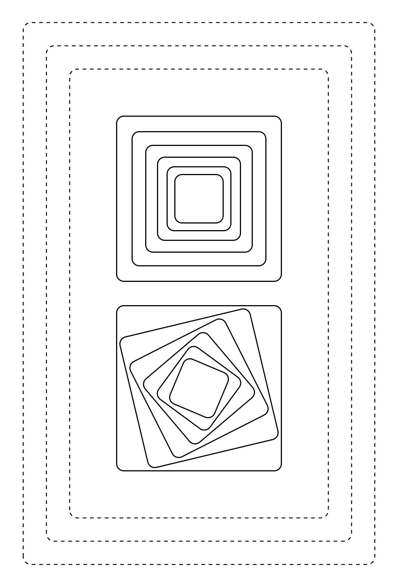
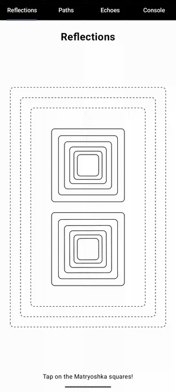
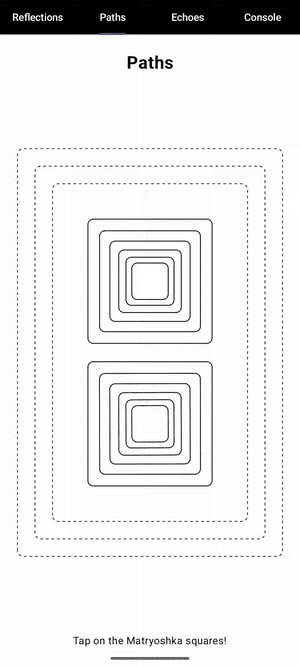
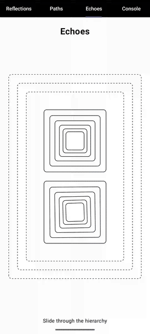

# Lineage

_Applier observation, path algebra, and lineage effects for Compose_

<p align="center">
  
</p>

---

## TL;DR

- **What**: Tap or drag over a node and see its ancestors and descendants highlighted.
- **How**: Three techniques—from familiar semantic queries to runtime observation of the whole tree (no per-node opt-in).
- **Why**: Compose makes tree-relative effects non-trivial. This repo explores what's possible.
- **Scope**: Reference code and demo app, not a library. Copy and adapt what's useful.

**Run the demo**:
```bash
./gradlew :app:installDebug
```
Launch the app and interact with nodes to see ancestors/descendants highlighted.

---

## The Problem

"Highlight this node's parent chain" sounds trivial. Compose's architecture makes it hard:

| You might try... | But... |
|------------------|--------|
| CompositionLocal | Flows down only—children can't query ancestors |
| Modifier chains | Each node only sees its own modifiers |
| Global ID map | Scales poorly, pollutes every composable |
| Prop drilling | Works, but requires threading state everywhere |

This repo explores three very different approaches that avoid prop drilling.

---

## The Approaches

| | Reflections | Paths | Echoes |
|--|-------------|-------|--------|
| **Idea** | Query semantics tree after tap | Track positions via DSL | Observe Applier mutations |
| **Opt-in** | Per-node | Per-node | **No per-node** |
| **Integration** | `val my = myOwn<Properties>()` | `Trail { }` wrapper | `EchoActivity` |

All three highlight the lineage. The difference is *where* the work happens.

The three approaches share the same algebra for reasoning about tree relationships, but the integration point differs dramatically.

### The Demo is in the Code

The app runs, but the relevant demonstration is in the source. Three files implement **identical UI** (the same nested boxes with the same animations):

- `Reflections.kt`
- `Paths.kt`
- `Echoes.kt`

Comparing them side-by-side reveals each approach's ergonomic cost. This replicated UI implementation can be found in its pure form, untouched by instrumentation, in `Echoes.kt` as `@Composable fun Untouched()`.

---

## Reflections

*Query the semantics tree when a tap occurs.*

```kotlin
data class Properties(
    val backgroundColor: Color = Color.White,
    val foregroundColor: Color = Color.Black
)

@Composable
fun MyScreen() {
    OurOwn(Properties()) {
        val my = myOwn<Properties>()
        Box(
            modifier = my.modifier
                .clickable { my.highlightLineage() }
                .background(my.own.backgroundColor)
        ) {
            Content()
        }
    }
}
```

`OurOwn<T>` and `myOwn<T>()` are generic—`Properties` here is your own per-node state type, not a library class. `OurOwn` provides a shared store scoped to the composition; `myOwn<T>()` returns a `My<T>` with the node's semantics identity, a modifier to attach it, and access to the current state via `my.own`.

When tapped, `highlightLineage()` walks the semantics tree, finds ancestors/descendants, and updates the shared store. Each node reads its highlight state from `my.own`.

**Trade-offs**: Uses patterns similar to `compose-ui-test` semantics queries. Requires per-node opt-in. Only sees nodes that expose semantics; merged semantics groups highlight as a unit.

<p align="center">
  
</p>

---

## Paths

*Track tree positions as you compose.*

```kotlin
@Composable
fun MyScreen() {
    Trail {
        // trek: this node's path
        // clicked: shared MutableState<Trek?> holding selected node's path
        val d = clicked.trek?.let { (trek - it).stride }

        Box(
            modifier = Modifier
                .clickable { clicked.trek = trek }
                .background(when {
                    d == null -> Color.White
                    d < 0 -> CornflowerBlue             // ancestor
                    else -> Color.hsv(d * 18f, 1f, 1f)  // descendant
                })
        ) {
            ChildContent()                              // Also in Trail { }
        }
    }
}
```

`Trail { }` provides `trek` (this node's path) and `clicked` (a shared `MutableState<Trek?>`).

Subtracting two treks yields a `Trek` representing their relationship. The `stride` property encodes the result: negative for ancestors, positive for descendants, `null` for unrelated branches. The trek operations are defined by a small algebra described in [Trek](#trek-the-algebra).

**Trade-offs**: Compile-time safety via `TrailScope`. O(1) local computation based on path differences. Requires wrapping each participating node.

<p align="center">
  
</p>

### Trek: Tree Arithmetic

Most systems separate "where I am" from "how to get there"—points vs vectors, paths vs relative paths, commits vs diffs. Trek doesn't. A single type represents both positions and deltas, with arithmetic that never throws:

```kotlin
val myPosition: Trek = trek                    // where I am
val clicked: Trek = clicked.trek!!             // where you clicked
val relationship: Trek = myPosition - clicked  // also a Trek!
```

Subtraction gives you the relationship. Addition applies it:

```kotlin
val delta = a - b        // how to get from b to a
val restored = b + delta // == a (round-trip property)
```

The `stride` field encodes relative depth; `trail` records the path:

```kotlin
when (relationship.stride) {
    null -> "different branches—we're not in the same lineage"
    0    -> "same node"
    -2   -> "ancestor, 2 levels up"
    3    -> "descendant, 3 levels down"
}

relationship.trail  // e.g. [1, 0, 2] — turns to take down a tree
```

Unrelated nodes don't throw—they return `Trek.Unrelated`, which absorbs further operations:

```kotlin
val unrelated = me - stranger // different branches
unrelated.stride              // null
unrelated + anything          // still Unrelated
```

The entire highlighting challenge reduces to one line:

```kotlin
val d = (trek - clicked.trek).stride
```

---

## Echoes

*Observe tree mutations with no integration changes to composables.*

**Integration**: Use `EchoActivity` as your base class:

```kotlin
class MainActivity : EchoActivity() {
    override fun onCreate(savedInstanceState: Bundle?) {
        // As usual from here...
    }
}
```

`EchoActivity` provides primitives for tree-aware effects. We've explored two—shaders and event recognizers—but the design space is wide open.

**EchoShader** defines how nodes respond to events. The mental model is similar to fragment shaders—each node evaluates the function to decide its visual state:

```kotlin
EchoShader { my, event ->
    val d = my.depthRelativeTo(event.target)
    when {
        d == null -> EchoIntent.Clear
        d < 0 -> EchoIntent.Highlight(CornflowerBlue)
        else -> EchoIntent.Highlight(Color.hsv((d * 18f).coerceIn(0f, 360f), 1f, 1f))
    }
}
```

**Event recognizers** like `EchoDragEvents` generate events that shaders respond to:

```kotlin
EchoDragEvents {
    MyApp()
}
```

These primitives are independent—use shaders without drag events, create new event sources, or combine them freely.

`MyApp()` remains unchanged—only the call site is wrapped, no additional modifiers or annotations inside the app. Unlike Reflections, Echoes works on the layout tree, not the semantics tree, so it also sees framework UI like the tab bar.

**How it works**

`ObservingApplier` wraps Compose's runtime applier, intercepting all tree mutations while delegating to the original. This gives Echoes visibility into the entire layout tree through the public `Applier<N>` interface—the same contract Compose itself uses. Once connected, all observation flows through public APIs:

| Concern          | Public API                                           |
|------------------|------------------------------------------------------|
| Tree structure   | `Applier<N>.down`, `up`, `insert*`, `remove`, `move` |
| Coordinates      | `Modifier.onPlaced`, `LayoutCoordinates`             |
| Semantics / text | `SemanticsOwner.getAllSemanticsNodes()`              |
| Modifier compose | `Modifier` composition                               |

**Accessing the public interface**

Compose doesn't expose a factory for its applier, so we instantiate internal types (`AndroidComposeView`, `UiApplier`) to reach it. This is the only required reflection—a doorway to the public contract, not a dependency on internal behaviour.

**Optional enhancements (reflection)**

These improve the experience but aren't required for core highlighting:

- **SetModifier interception**: Core highlighting works through the public `apply()` callback. However, Compose rewrites modifier chains on recomposition, wiping injected highlights. For animations where highlights must persist, we optionally intercept `ComposeUiNode.SetModifier` to inject modifiers *before* apply. If this fails, static highlighting still works.
- **Coordinate lookup**: Hit-testing uses public `Modifier.onPlaced` coordinates; `NodeChain.outerCoordinator` is a reflection fallback for cache misses. Without it, hit-testing still works via the public path.
- **Console features**: Tree snapshots (`_foldedChildren`) and node naming (`measurePolicy`) are Console-only. For explicit naming, use the public `Modifier.echo("name")` instead.

<p align="center">
  
</p>

---

## Structure

This repository ships reference code and a demo app, not published library artifacts.

```
lineage/
├── app/
│   └── src/main/java/.../demos/
│       ├── reflections/          # ReflectionsToolkit, OurOwn/myOwn DSL
│       ├── paths/                # Trek algebra, Trail DSL
│       └── echoes/               # EchoActivity, EchoShader, ObservingApplier
└── docs/
    └── images/
```

---

## Requirements

Tested with:
- Kotlin 2.2.21
- Compose BOM 2025.11.00
- Android API 26+

---

## License

Apache 2.0. See [LICENSE](LICENSE).
